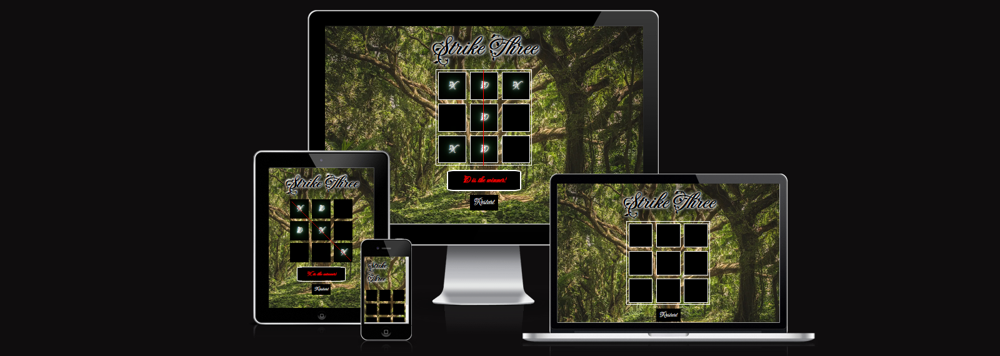
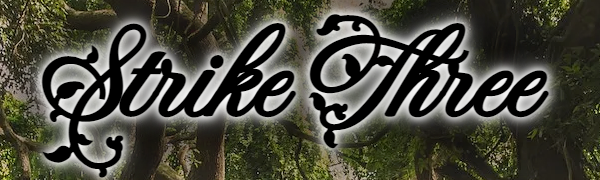
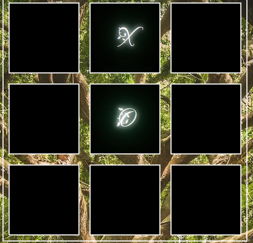
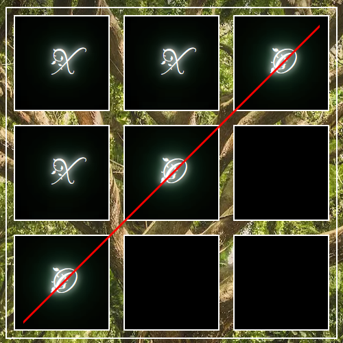
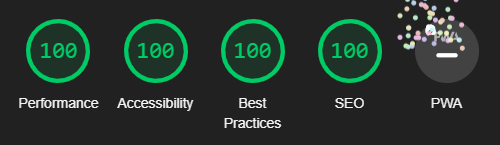

# Strike Three

Strike three is a very simple site for a very simple need: to unwind, relax and play a fun game with a friend. The goal of the game is to get three in a row before your opponent does. One player uses "X" and the other uses "O". The game also comes accompanied by a nice relaxing background and some fun sounds, and you can always restart the game at any time with the handy "Restart button". Whenever one player manages to get three in a row the game will let the players know by striking a line through the winning cells and proclaim either "X" or "O" as the winner.

## Features

* Title and background image
  - Inviting and memorable title to welcome all players.
  - The background image gives a calm impression.

* The game board
  - Intuitive and welcoming.
  - Features a distinctive "X" and a distinctive "O" to represent each player.

 

* The Game Over
  - A clear red line will indicate to the players which three cells are the winning combination.
  - A message will pop up proclaiming a winner so there can be no doubt as to who actually won.

 

* The restart button
  - A button to restart the game is present at all times should the players wish to restart mid-game.
  - It also serves the important purpose of restarting the game once a winner has been proclaimed.

* Sounds
  - Fun sounds will play when one of the players click on a cell, win a game or restart the game for a more exciting experience.

 

## Testing

* I have tested that the site works in the following browsers: Firefox, Google Chrome and Microsoft Edge.

* I can confirm that the site is responsive, i.e. looks good and functions, on all common screen sizes.

* I can confirm that all elements of the site are easy to read and understand.

* I have tested that all possible outcomes of the game work as intended.

 

### Bugs

* No major or unusual bugs were encountered during development.

 

### Validator Testing

 

* HTML
  - No errors were returned when passed through the official [W3C HTML validator](https://validator.w3.org/nu/?doc=https%3A%2F%2Fdrakain.github.io%2Fthree-in-a-row%2F).

 

* CSS
  - No errors were returned when passed through the official [W3C CSS validator](https://jigsaw.w3.org/css-validator/validator?uri=https%3A%2F%2Fdrakain.github.io%2Fthree-in-a-row%2F&profile=css3svg&usermedium=all&warning=1&vextwarning=&lang=en).

 

* JS
  - No errors in Javascript were returned when passed through the [JSHint validator](https://jshint.com/).

 

* Lighthouse
  - I confirmed that the site is accessible and has good a performance score through Lighthouse in devtools.

     

 

  ### Unfixed Bugs

  * There are no unfixed bugs.

   

## Deployment

  * The site was deployed to GitHub pages. The deployment steps are as follows:
    1. Enter the GitHub repository.
    2. Navigate to the "Settings" tab.
    3. Find the "Pages" tab in the menu to the left and click it.
    4. Find the "Select branch" drop-down menu under the "Branch" heading.
    5. Select "main" as your branch and save.
    6. Refresh the page after a short while in order to be provided with a link to the now deployed site.

   

  * The live link can be found [here](https://drakain.github.io/three-in-a-row/).

   

  ## Credits

  ### Media

  * The backhround image was taken from [Pexels](https://www.pexels.com/).

  * The sounds were taken from [Mixkit](https://mixkit.co/free-sound-effects/).